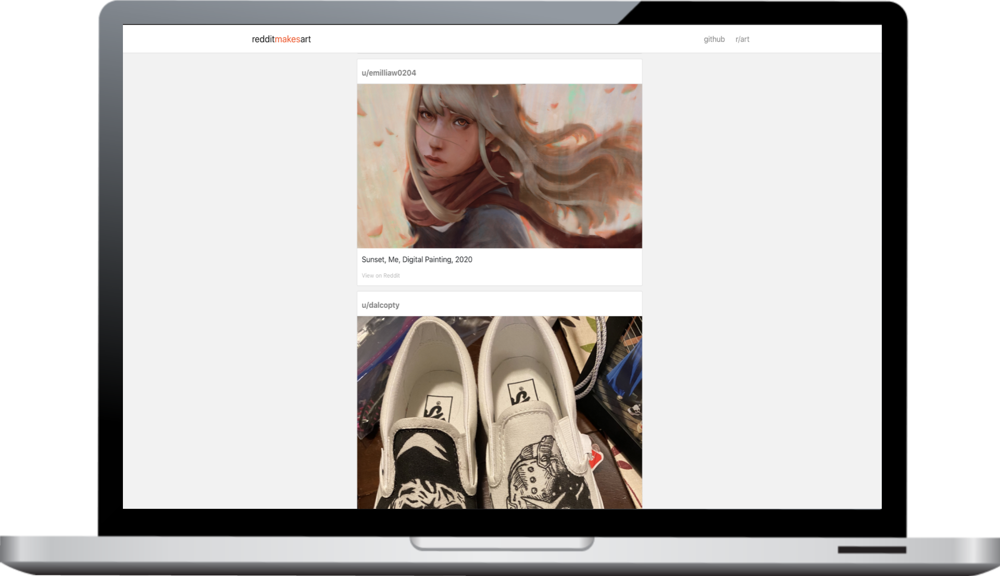

# RedditMakesArt

A website which showcases all **original art content** pieces created by Reddit users on the *r/art* subreddit.

## Technologies Used
- React (create-react-app) for the front end with asynchronous loading
- Flask back-end for abstracting all database requests
- [AWS](https://aws.amazon.com/)
  - EC2 for hosting website, using NGINX as a webserver
  - Lambda for periodically scraping the r/art subreddit using the Reddit API and storing into a database
  - RDS (MySQL) for easy and secure storage of all image metadata
- [PRAW](https://praw.readthedocs.io/en/latest/)
  - Python wrapper for Reddit API, making it easier to scrape

### What is the Lambda used for?
The Lambda is used to periodically run a custom Python scraper which retrieves the Top 100 submissions of the day on the r/art subreddit. These submissions are then filtered by:
- Whether or not it was original content. This is checked by making sure that the author of the art piece is the same as the reddit user who uploaded the art.
- Making sure it is an image/gif. Any other submissions such as videos, text etc. are filtered out
- Non - NSFW only. All NSFW posts are filtered out

As you can imagine, from the original 100, only a subset of those will remain at the end, and sometimes it is not too many.

#### Why use a Lambda? Why not just run a cron job on EC2?
I could've but where's the fun in that? Besides, it seemed interesting to compartmentalize all of the different components of the project: the web platform, the scraper, and the database. Theoretically this can be all done by running my own database on EC2 and use cron to periodically get my images, but then I'm leveraging none of the tools that AWS provides.

Which brings the next more commonly asked question..

### Why use AWS? Why not just use a different web hosting platform?
Simply because AWS is interesting and I wanted to learn it. I could've made this on a different platform which takes care of everything for me. Something that runs my web application, exposes required ports and proxies all HTTP requests, but why not just do it on my own?

Besides, by using AWS, I was able to leverage not just EC2 but also Lambda and RDS, which is a deviation from my original idea of the project but it made the infrastructure A LOT more modular, neater, and easier to maintain.

## Why did I make this?
I think Reddit has a lot of beautiful original content created by many people across many different subreddits. You can go on subreddits such as [r/writingprompts](https://www.reddit.com/r/writingprompts) or even fanbase specific subreddits such as [r/DotA2](https://www.reddit.com/r/dota2) or even the best university subreddit in the world: [r/uwaterloo](https://www.reddit.com/r/uwaterloo), and you'll find fantastic pieces of work created by the wonderful users on Reddit. In my opinion, a lot of the original content that many people create deserves their own platform, something that showcases what Reddit can really do, and not just how negative and toxic it can be.

So I decided to pick one of these subreddits to showcase, and the one that I happen to frequent is [r/art](https://www.reddit.com/r/art), hence I decided to pick it as the subreddit that I wanted to showcase.

Reddit is not as bad as people deem it to be. Furthermore, there's A LOT of talented people out there, and all that talent can be easily shrouded by all of the noise on the internet. An art-gallery like showcase, such as the aesthetic of RedditMakesArt, hopes to eliminate all of that and just showcase the art for what it is, hopefully garnering the recognition that it deserves.

### Disclaimer
None of the art pieces on the website is mine. All credit goes to Reddit, and each submission has a link to the original submission on Reddit.
